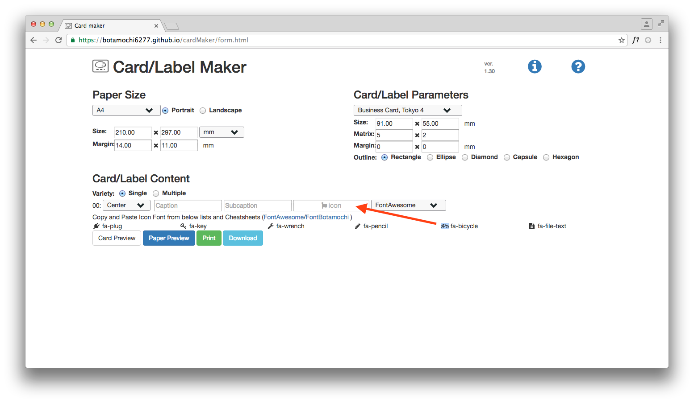
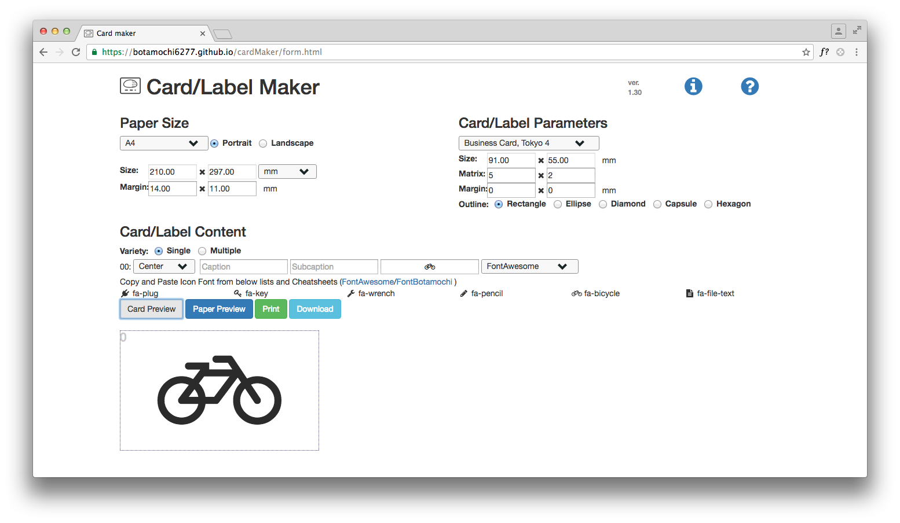
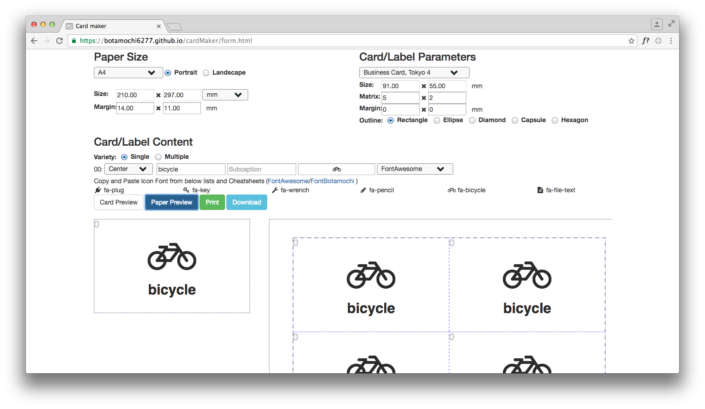
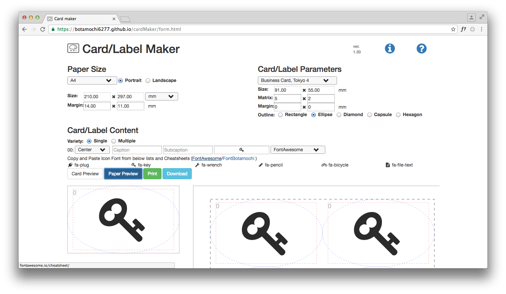
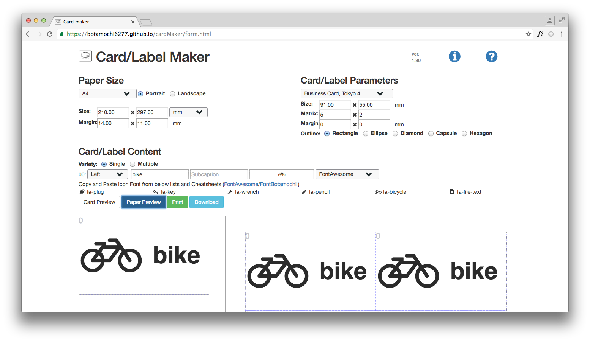
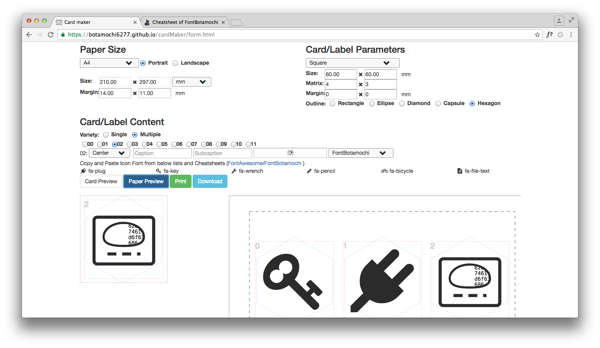
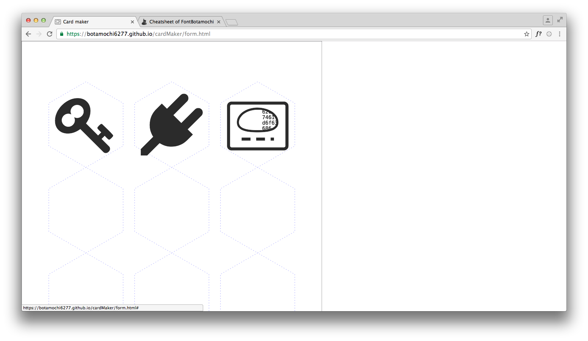

# cardMaker
Card/Label Maker in Javascript with Icon Fonts

Operating environment: Google Chrome.

### Usage
1. Access <form.html>
2. Fill forms: paper size, card/label parameters and card/label contents.
3. Click **Card Preview** and **Paper Preview** bottoms.
4. After check card/label design, click **Print** button.
5. Print this page with no margin.
6. You can be back the form page by clicking a paper image.

  You can copy and paste **icons**.

  **Card Preview** button shows card design.

  **Paper Preview** button shows paper design.

  You can add  **Caption**.

  **Outline** radio changes card shape.

  **Layout** select changes placements of contents.

  **Multiple** radio allows a paper to have various cards.

  **Print** button hides everything except the paper. Please print (Cmd+P/&#x2318;+P) this page with no margin.
